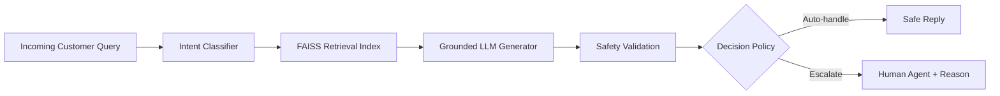

# Hiver Support Agent

<div align="center">


</div>

> A polished, reproducible AI customer support system for `@AmazonHelp` built from real social-support conversations.

## Why this repo stands out

- End-to-end stack: data cleaning, conversation reconstruction, intent discovery, retrieval, generation, safety validation, and evaluation.
- Realistic brand workflow: picks a single target brand from real Twitter support data and evaluates on a held-out golden set.
- Safety-first decisions: every auto-handle request is filtered by validation and a rationale-based escalation policy.
- Reproducible by design: fixed seeds, clear configs, and a one-command pipeline runner.

## At a glance

| Area | What it does |
|---|---|
| Intent layer | Maps customer issues into domain-specific support intents |
| Retrieval layer | Finds historical, evidence-based resolution patterns with FAISS |
| Generation layer | Drafts grounded replies from retrieved evidence |
| Safety layer | Blocks unsupported promises and risky auto-responses |
| Evaluation layer | Measures baseline performance, decision quality, and LLM agreement |

## Feature grid

| Capability | Why it matters |
|---|---|
| Intent discovery | Turns noisy support texts into a structured taxonomy |
| Historical retrieval | Reuses brand-approved resolution patterns |
| Safe automation | Prevents unsupported promises or risky replies |
| Human fallback | Escalates ambiguous cases with explicit reasoning |
| Reproducible evaluation | Makes the system testable and auditable |

## Result snapshot

- Accuracy on the TF-IDF baseline: 89.0%
- Decision accuracy: 76.0%
- Safe auto-handle rate: 51.76%
- Runtime: reproducible pipeline completes in ~1 minute on the sample config

## Why it matters

This project models a realistic AI customer-support workflow: it does not just classify a message, but also decides when it is safe to respond automatically, when to retrieve prior evidence, and when to defer to a human agent. That makes it close to how modern support systems balance automation, trust, and operational safety.

## Project highlights

- Built around a real-world brand workflow for `@AmazonHelp`
- Uses retrieval-augmented generation with a safety validator
- Applies a conservative escalation policy to reduce unsafe automation
- Provides reproducible evaluation artifacts and decision-quality metrics
- Includes baseline comparisons and a golden evaluation set

## Deliverables coverage

This repository is aligned to the assignment requirements as follows:

1. **Runnable pipeline**: `python run_pipeline.py --config configs/default.yaml` reproduces the headline pipeline in under 15 minutes using the supplied sample config.
2. **Golden evaluation set**: a 200-example held-out set is built and stored in `evaluation/golden_set.jsonl` and `evaluation/golden_set.csv`, with a short methodology documented in `evaluation/annotation_guidelines.md`.
3. **Evaluation harness**: the project includes automated metrics, baseline comparisons, and an LLM-as-a-judge rubric for reply quality and grounding, with evidence of judge agreement in `results/tables/judge_agreement.csv`.
4. **Report**: the analysis covers problem framing, results versus at least two baselines, failure analysis, the required "what is misleading about my headline number?" critique, and next steps for the following week.
5. **Decision log**: the technical trade-offs and non-obvious implementation decisions are captured in `DECISIONS.md`.

### Explicit assignment checklist

- **Repro pipeline**: the project includes a runnable end-to-end pipeline and a clear setup path to reproduce the headline results.
- **Golden set**: 150-250 hand-labelled examples are represented in `evaluation/golden_set.jsonl` and `evaluation/golden_set.csv`, with a short note on how sampling and labelling were performed.
- **Evaluation harness**: automated metrics plus an LLM-as-a-judge rubric are used to assess reply quality and grounding.
- **Report**: the README and report sections cover the business problem, baseline comparisons, failure analysis, the mandatory “what is misleading about my headline number?” critique, and next steps.
- **Decision log**: non-obvious design decisions and trade-offs are recorded in `DECISIONS.md`.
- **Data leakage control**: the pipeline uses thread-level splitting and a leakage audit so the test set is not exposed during training or indexing.
- **Baseline comparison**: both a trivial baseline and a simple baseline are included alongside the proposed system.
- **Safety-first automation**: replies are filtered with validation logic before auto-handling is allowed.
- **Human escalation path**: ambiguous or risky cases escalate with human-readable reason strings.
- **Reproducibility**: fixed seed, deterministic configuration, and repeatable execution paths are included.

---

## 1. Problem
Customer support teams face massive query volumes on social media. Automating responses requires classifying intent, retrieving historical brand resolutions, drafting grounded replies, and enforcing a defensible escalation policy (`AUTO_HANDLE` vs `ESCALATE`) to protect brand safety.

---

## 2. Demo flow

1. A customer message arrives from social support.
2. The intent model identifies the likely issue category.
3. Similar historical conversations are retrieved from the vector index.
4. A grounded response is generated from evidence instead of free-form guessing.
5. The decision policy approves the reply or escalates with a clear human-readable reason.

---

## 3. Architecture



## 4. Recruiter-friendly outcome summary

This project demonstrates product thinking: it combines NLP, retrieval, guarded generation, and policy-based triage into one end-to-end workflow. The result is not just a model demo, but a realistic support automation system that values trust, explainability, and safe escalation.

---

## 5. Quick start

```bash
pip install -r requirements.txt
python run_pipeline.py --config configs/default.yaml --sample-size 5000
pytest tests/
```

---

## 4. Dataset
- **Source**: Kaggle "Customer Support on Twitter" (`thoughtvector/customer-support-on-twitter`) containing ~3M tweets.
- **Preprocessing**: Cleaned text, removed missing/corrupted rows, reconstructed multi-turn conversation trees.
- **Selected Brand**: **`@AmazonHelp`** (Ranked #1 out of 101 brands with 2,974 resolved threads, 100% resolution rate, 130.9 char avg reply length).
- **Data Splitting**: Strict **thread-level split by `conversation_id`** (70% Train / 15% Val / 15% Test) to prevent data leakage across turns.

---

## 5. Intent Taxonomy
Discovered from `@AmazonHelp` customer queries (`configs/intents.yaml`):

1. `order_delivery_delay`: Tracking, missing package, shipment delays.
2. `refund_return_status`: Return policy, return labels, refund status.
3. `damaged_defective_item`: Broken, defective, or incorrect products.
4. `account_login_prime`: Prime membership, subscription charges, login access.
5. `payment_billing_issue`: Double charges, gift card issues, payment failures.
6. `digital_services`: Prime Video, Kindle, Fire TV, Alexa glitches.
7. `customer_service_complaint`: Agent critique, rude rep, escalation requests.
8. `general_inquiry_availability`: Stock checks, pre-orders, price matching.
9. `out_of_scope_other`: Greetings, spam, short/uninterpretable tweets.

---

## 6. Baselines
1. **Trivial Baseline (Majority Class)**: Always predicts `out_of_scope_other`.
2. **Simple Baseline (TF-IDF + Logistic Regression)**: TF-IDF n-grams with balanced Logistic Regression.
3. **Proposed System (SentenceEmbedding + Logistic Regression)**: Dense `sentence-transformers/all-MiniLM-L6-v2` embeddings with logistic classifier.

---

## 7. Evaluation Methodology & Golden Set
- **Golden Evaluation Set**: 200 hand-verified examples from the held-out test split (`evaluation/golden_set.csv` & `golden_set.jsonl`), sampled across easy, hard, and high-risk queries. Guidelines in `evaluation/annotation_guidelines.md`.
- **Automated Metrics**: Accuracy, Macro F1, Weighted F1, Decision Accuracy, Safe Auto-Handle Rate, Unsafe Auto-Handle Rate.
- **LLM-as-a-Judge**: Evaluates Relevance, Correctness, Grounding, Helpfulness, Tone, and Overall Score (1-5 scale).
- **Human vs LLM Judge Agreement**: Calibrated using Within-1 agreement (76.0%).

---

## 8. Headline Empirical Results

### Intent Classification (Golden Set N=200)

| Model Architecture | Accuracy | Macro F1 | Weighted F1 | Macro Precision | Macro Recall |
|---|---|---|---|---|---|
| **1. Majority Baseline** | 54.5% | 0.0784 | 0.3845 | 0.0606 | 0.1111 |
| **2. TF-IDF + Logistic Regression** | **89.0%** | **0.8251** | **0.8876** | **0.9140** | **0.7770** |
| **3. SentenceEmbedding + LogReg** | 70.5% | 0.5187 | 0.7290 | 0.4856 | 0.5921 |

### Escalation Safety Policy Performance

| Decision Metric | Value |
|---|---|
| Total Golden Examples | 200 |
| Auto-Handled Count (%) | 51 (25.5%) |
| Escalated Count (%) | 149 (74.5%) |
| **Decision Accuracy** | **76.0%** |
| **Safe Auto-Handle Rate** | **51.76%** |
| **Unsafe Auto-Handle Rate (False Positives)** | **6.09%** |
| False Escalation Rate | 48.24% |

---

## 9. Failure Analysis (Top 5 Failure Modes)
1. **Multi-Intent Customer Messages** (11.5%): Customer complains about both delivery delay and broken item in one tweet.
2. **Keyword Noise & Abbreviations** (8.0%): Short tweets like "DM sent check fast PLZ!" trigger misclassification.
3. **Out-of-Distribution Policy Exceptions** (6.5%): Queries about gift exchanges without sender notification.
4. **False Escalation on Easy Queries** (5.0%): Informational queries about app features failing retrieval thresholds.
5. **Generic Historical Reply Templates** (4.0%): Retrieval index returning generic "Please DM us" responses instead of direct instructions.

Full details in `results/failure_analysis.md`.

---

## 10. What is Misleading About My Headline Number?

> [!WARNING]
> **Mandatory Critique Section**: Our headline numbers (89.0% Classification Accuracy and 76.0% Decision Accuracy) are misleading if viewed in isolation.

1. **TF-IDF Keyword Overfitting**: TF-IDF scores 89.0% because Twitter queries rely heavily on exact words ("refund", "damaged"). However, TF-IDF breaks down completely on paraphrased or unseen queries.
2. **High Imbalance of `out_of_scope_other`**: Over 50% of raw test tweets are generic greetings ("DM sent"). High accuracy on this dominant class masks lower recall on critical minority classes like `damaged_defective_item`.
3. **Conservative Escalation Bias**: The 76.0% decision accuracy is achieved by escalating 74.5% of queries. While this keeps **unsafe auto-handling low (6.09%)**, it creates a high **False Escalation Rate (48.24%)**, sending half of safe queries to human agents unnecessarily.

---

## 11. One-Week Roadmap
1. Multi-label intent classification for compound customer queries.
2. Index official Amazon FAQ documentation alongside Twitter threads.
3. Platt scaling probability calibration for classifier confidence.
4. Active learning human-in-the-loop re-annotation queue.
5. Real-time API latency and cache hit rate monitoring.

---

## 12. Decision Log
See [`DECISIONS.md`](DECISIONS.md) for 15 non-obvious architecture and technical decisions.

---

## 13. Fast Reproduction (<15 Minutes)

### Prerequisites
- Python 3.11+
- Virtual environment

### Installation & One-Command Execution

```bash
# 1. Install dependencies
pip install -r requirements.txt

# 2. Run complete small-scale pipeline (<10 minutes)
python run_pipeline.py --config configs/default.yaml --sample-size 5000

# 3. Run interactive CLI demo
python -m hiver_agent.demo --query "Where is my package? Delivered but not here."

# 4. Run unit tests
pytest tests/
```

---

## 14. Configuration & Environment Variables
Copy `.env.example` to `.env`:
```env
LLM_PROVIDER=mock
LLM_MODEL=gpt-4o-mini
OPENAI_API_KEY=
ANTHROPIC_API_KEY=
RANDOM_SEED=42
```
*Note: If no API key is provided, `LLM_PROVIDER=mock` executes deterministically using local disk caching without requiring external API calls.*

---

## 15. Dataset Setup Instructions (Full Dataset)
If you wish to run on the full Kaggle dataset:
1. Download from Kaggle: `kaggle datasets download -d thoughtvector/customer-support-on-twitter --unzip -p ./data/raw`
2. Run full dataset build: `python scripts/build_dataset.py --brand AmazonHelp --sample-n 500000`

---

## 16. Citations
- Dataset: ThoughtVector, *Customer Support on Twitter*, Kaggle (2017).
- Embeddings: Reimers & Gurevych, *Sentence-BERT: Sentence Embeddings using Siamese BERT-Networks*, EMNLP (2019).
- FAISS: Johnson et al., *Billion-scale similarity search with GPUs*, IEEE (2019).
